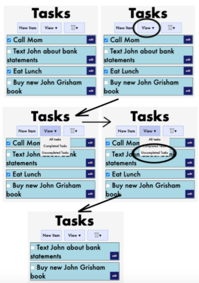

# Design Document
Kristen Mason & Hilary Nelson

####  Overview
The goal of this project was to design a mobile webapp using HTML and CSS that will act as scaffolding for future lab projects. The purpose of the webapp was to manage a list of items to complete. The app support the functionality to add new tasks, mark tasks completed, rename tasks, and update the task view so that users can view all of their completed or incomplete tasks. It also provides functionality for users to delete all of their completed or incomplete tasks. As this lab was primarily design focused, these HTML & CSS files function as snapshots of the state of the screen at the beginning of the task, the state of the screen at the end of the task, and the state of the screen during intermediate portions of the task as necessary. 

#### Design Decisions & Alternative Designs Considered
Coming into this project, we wanted to design a webapp that was channeling the intersection of Kanban boards and the typical, pen and paper TODO list. We knew that we needed functionality to add new items, check off items as completed, rename items, and organize the list, so we sketched out a rough draft of what we wanted our components to look like (see Figure 1).

(Figure 1)

We drew inspiration from the organization site Notion.so (see Figure 2) for our app's minimalist design and straightforward concept.

(Figure 2)

Originally, we considered having a unique button for each menu option. After playing around with that layout for a few days, we decided that it was too crowded and would cause confusion from users (not to mention, it opened up the possibility of disasterous mis-clicks, where the user might click on the 'delete all' option instead of the 'view complete items' option.) (See Figure 3).

(Figure 3)

In a similar vein, we went back and forth between whether or not the words that we were using to describe the user actions could be better represented by pictures. We imagined a design similar to the modern gMail email inbox, where users have the ability to view all unread emails. (See Figure 4)

(Figure 4)

However, we realized that utilizing the checkbox could lead to some confusion where the user might think that if they clicked the checkbox they would be able to select all tasks in their list, when that wasn’t actually a desired functionality of our app. We needed to move away from an implementation that used visual cues that corresponded to behavior that we aren’t actually implementing in our web app. Instead, we opted to turn the view selection & delete options into dropdown menus– this provided separation between the 2 different actions. We separated these out to reduce user confusion or misclicks– any user who wanted to delete their items would have to go through 2 taps as opposed to one if we hadn’t made the delete button into a dropdown menu.

We chose to use the trash can to represent the delete button instead of using the text “delete” because using the trash can for deleting objects is a widely used iconography within web development, which makes it easily recognizable in terms of what the button means and what action is associated with it.

#### Design Tasks and Walkthrough

This is the flow for task 1: creating an item named "Buy new John Grisham book" in an empty list

This is the flow for task 2: creating an item named "Eat Lunch" in a non-empty list

This is the flow for task 3: Marking the item named "Call Mom" completed

This is the flow for task 4: Renaming the item "Text John" to "Text John about bank statements"

This is the flow for task 5: Show only uncompleted items

This is the flow for task 6: Delete all completed items.

#### Challenges Faced
We faced a lot of challenges with the layout of the buttons and actual tasks (see Figure 5). One thing that we realized during this process was when it’s best to make a new html class vs to use an existing one. For example, we originally gave each task its own class, but in the final product it was better to have one class for all the tasks and then put the tasks all into a container. In general, I think we faced a lot of challenges related to not doing quite enough planning for the actual html, even though we did do enough planning for the design. Even though this was frustrating at some points of our lab, it showed us what we need to change about our design process for lab 2.

(Figure 5)

#### Parts of Design We're Most Proud Of
We are really happy with the overall layout of the app, but we think that the thing we’re most proud of is the final design of the menu buttons. We struggled to walk the line of a minimalist design while still making functionality clear. We finally settled on a “dropdown” style menu for each of the two options (view and delete), each providing the same choices (all tasks, uncompleted tasks, and completed tasks), for a clean but clear menu. We are also pleased with the way the final color scheme came together for a sleak, coherent interface.
