# Design Document
Kristen Mason & Hilary Nelson

#### Design Decisions & Alternative Designs Considered

We were very intentional about our login design, again trying to keep the design consistent with the rest of the app. We wanted to ensure that a user knew exactly how to login upon arriving at our home page, and that they had a variety of login choices if they did not want to create an account with us. Another thing we wanted to make sure of was that a user could retrieve their account if they chose to make an account with us, so we added a forgot password button. We wanted our homepage to be inviting and intuitive, so the main focus is the login choices, but we did also add some fun “time saving tips” at the button based off of lessons we’ve learned throughout CS124, so that users feel more welcome.

Our Final Design for the login screen:

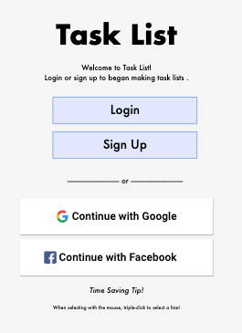

We drew lots of inspiration for the layout of our initial landing page from Tumblr, as shown below:

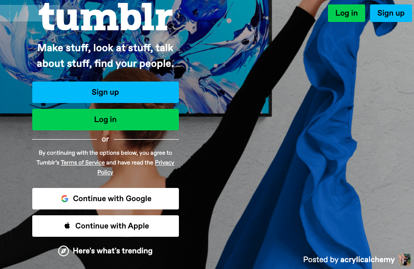

We thought that the centralized layout of the design was well suited for our task list, since we’ve already been using lots of button functionality within our app, it was an easy logical leap to make this design choice.

We also made the design choice to allow users to share their task lists via SMS (text messaging)– we believed that this would add a significant amount of value and usability for users who might use our app on desktop but want a particular task list with them on their phone when they are, say, grocery shopping. We provided a popup similar to the one we gave for sharing via email, and once the send button is pressed, a text message is sent to the input phone number. We used Twilio’s API to accomplish this, but the one drawback of Twilio’s API is that you must be on the paid plan in order to send text messages to any number input into the field. However, we decided to workaround this by having Prof. Rhodes input his number as one of our “verified phone numbers” in the Twilio dashboard so it works for his testing/grading purposes!

Text Messages Sent from out React App With Task List Information:

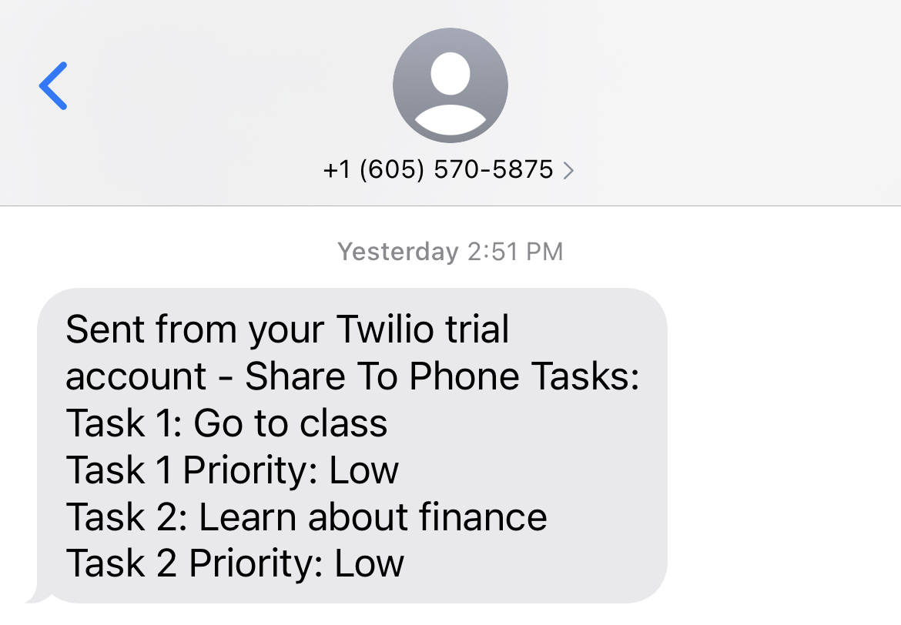

Another design decision we made was to incorporate a UI component that would indicate the strength of a user’s password when they sign up in our app. We wanted to include this to add an added layer of security to our app, as well as provide the user a gauge to see how secure their password is in real time as they type. We also added the ability to toggle the view of one’s password while logging in, and if the user forgot their password, our app allows users to click the “Forgot My Password” button and have a password reset link sent to the email associated with their account.

Our Password Strength Bar incorporated into the app:

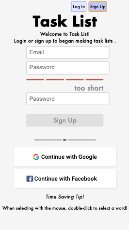

Our Forgot Password Button incorporated into the app:

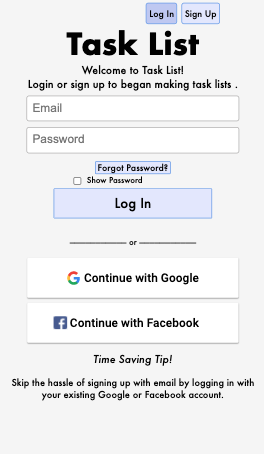

We based our sharing choices off of Apple’s notes app, in which once a note is shared, full privileges are automatically granted to any user that the note is shared with. That is, once a user is added to a task list they are able to edit the task list name and all tasks within it, and even delete the task list (or share it with others). We decided that because a task list could be shared for view only via text message that it would be simplest for the user to only share for editing privileges when adding someone via email.

#### Alternative Designs Considered

The majority of our alternative designs in this process involved the placement of the login buttons. Originally, there were only login and sign up buttons and they were reactive. After exploring other pages that have login/sign up buttons on the homepage, we noticed that the button size was consistent and never reactive, and we thought this looked nicer and decided to implement it in our app as well. Another thing we added was the smaller login and sign up buttons in the top right corner, which we also saw on outside websites and thought was helpful. That way, once a user clicks login/sign up from the main buttons in the center, they can still easily see how they might choose the alternative option if they did not select the correct one.

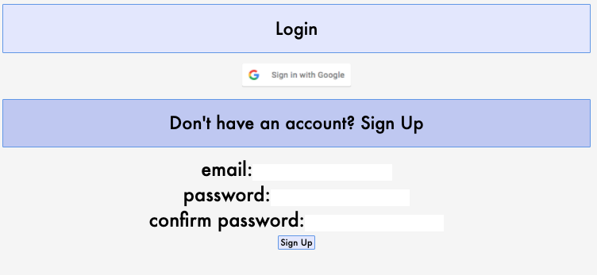

Another alternative design we considered was making our Login, Sign Up, and initial landing screens all exist within the same component, and manipulate the DOM to determine which version of the app was visible at any given point in time. However, we realized that rummaging around in the DOM and directly modifying elements’s CSS was not the best approach, and caused several visual bugs as shown below. Instead, we opted to break each screen out into its own component and control the visible component through a useState variable, that way the proper screen was shown consistently across rerenders of the page.

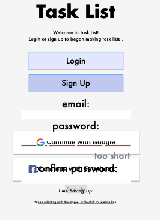

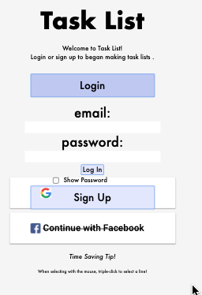

### User Testing

User 1 had seen the app in a previous iteration and was very excited about login capabilities. They chose to log in with Google rather than creating an account, and said they felt that option was easier and more secure. They had no issues navigating through the log in and were already familiar with the task list views and happy with them. The user also appreciated that an email had been properly formatted for the list to be shared, since they were worried about accidentally sending the email before it was correctly entered. 

User 2 was new to our app and also had no issues using it. They also chose to log in with Google and had no issues creating and naming task lists, adding, editing, and sorting tasks, or sharing the lists. Neither user 1 or user 2 had anything they suggested that they would like changed to increase usability or overall aesthetics of the app.

#### Design Tasks and Walkthrough

Below is the walkthrough of our app.

Start with the initial landing screen: 

Then navigate to either the Log In or Sign Up buttons.
Log In:

Sign Up:

Once there, sign up/login using a valid email and password, or an error will be displayed

Login Error: 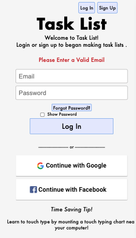
Sign Up Error: 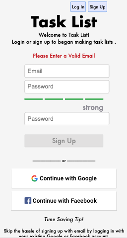

The sign up screen also displays password strength, and the login screen offers users the ability to toggle the visibility of their password with a checkbox, as shown below.

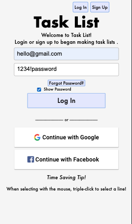

The user can also log in through Facebook or Google, which will trigger these popups:
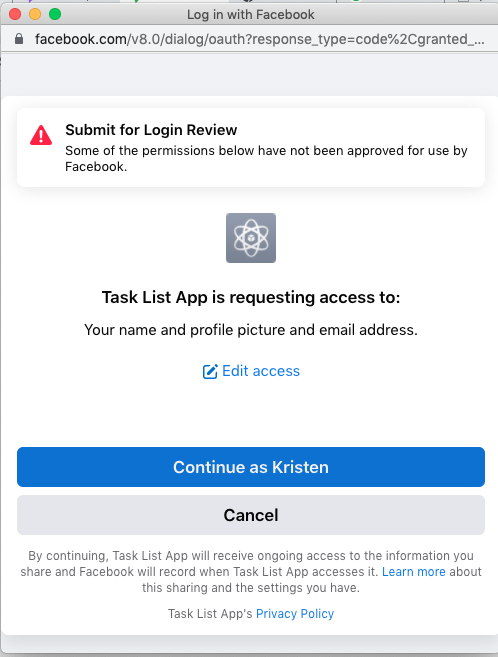

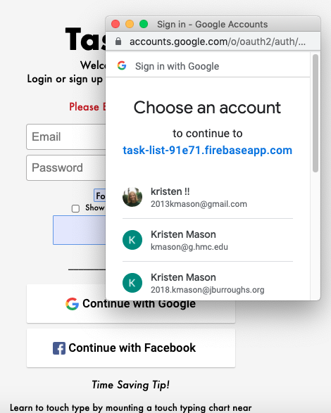

Once logged into the app, the users home screen looks like it did in Lab 4, with the addition of a space for shared lists:
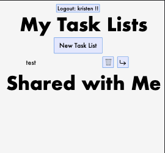

Once at their home screen, the user can create and navigate to new task lists. Once the user is inside the task list, they have 2 ways through which they can share their task list– through email or SMS.

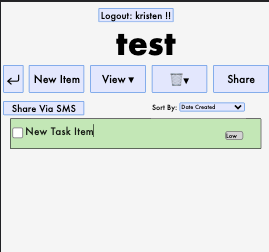

If the user shares vis SMS, a similar popup appears, prompting the user for their phone number. 
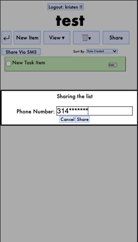

Once they confirm the phone number they want to share the task list with and hit send, a SMS message is sent to that number, similar to the one below:

If the user shares via email, a popup will appear, prompting the user for the email with whom they would like to share their list:

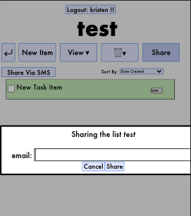

However, if the user attempts to share a list with themselves, it flashes an error: 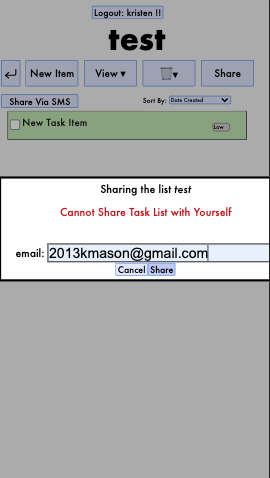

Once a user shares a task list with another user, it appears under the "Shared With Me" task header for the other user. In the image below, my email shared a list with the user hello

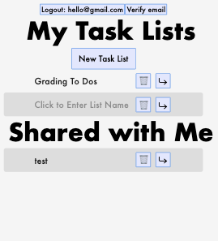

The user with whom the task list was shared can access the shared task list as they would any task list of their own, as shown below:

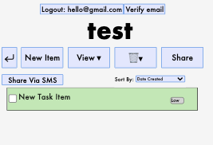

That concludes the walkthrough of all new features added to our webapp since Lab 4.

#### Challenges Faced

We faced a variety of challenges with this lab. When creating the share by email button, we had a lot of trouble both with the formatting of the popup, and also confirming that the email was not an invalid email address (and therefore not letting the user share the task list to that address). We also had some issues with the login and sign up tabs opening on top of each other, among other formatting issues on the homepage.

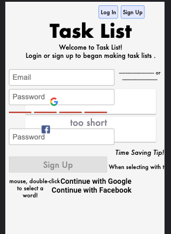

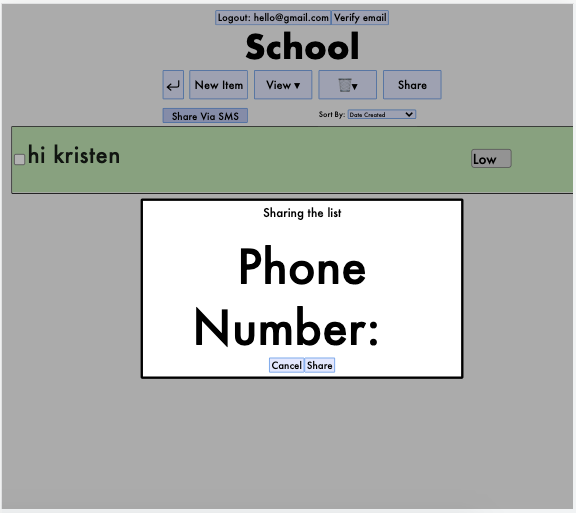

  We also faced a huge challenge when trying to get our app authentication working with Facebook. We had to create a new app within the Facebook developer console, whitelist our deployed URL within said developer console, and then had to secure Advanced Access to the user’s public profile in order to even have the login screen appear within a popup.
  Another design challenge we faced was making the transition between our app’s initial landing page, login page, and signup forms as seamless as possible. We originally tried to accomplish this switch through pure CSS, but ran into issues when incorporating error messages, and had to refactor our entire app so that each of the 3 landing pages were spaced out into separate components.

  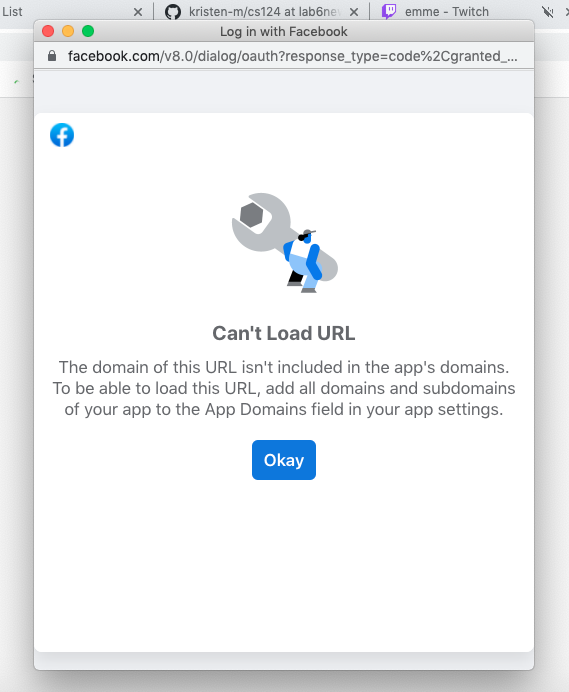
  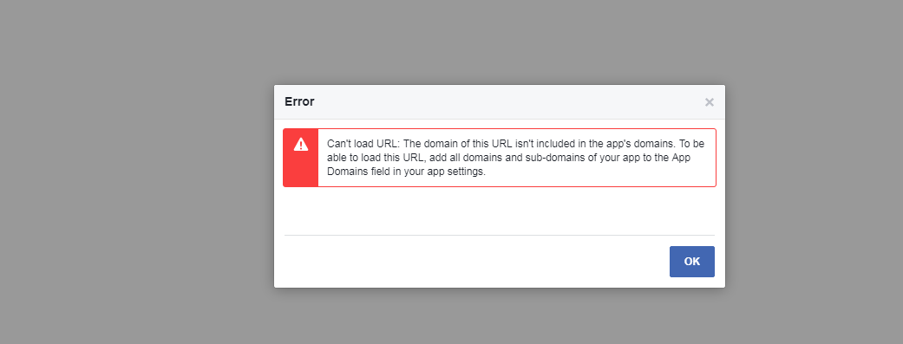

#### Parts of Design We're Most Proud Of

We are very proud of the design of our new homepage. All the things that a user might want to do upon arriving at our task list app are very clearly displayed, and align with the styling of the rest of our task app. In particular, we like the design choice we made to provide smaller login/sign up buttons in the top right corner of the screen once a user selected the Login or Signup buttons on the initial screen, to give them the opportunity to switch between the two screens.
Another feature that we were proud of implementing in this app was the OAuth logins with both Google and Facebook. As mentioned in the section above about challenges faces, we ran into several issues while integrating the Facebook login into our webapp, but instead of giving up and pivoting to a different login method, we persevere and produced a very professional looking sign up area with the social media buttons (of which we were proud of the design for as well!)

We were also proud of our popup interface for sharing task lists– we drew inspiration from the sharing functionality within GSuite Apps (google drive, google docs, sheets, etc.) to display a popup to the user, and even prevented the user from sharing task lists with themselves!

The final part of the design that we take the most pride in was the integration of sending the user’s task lists to their phone via SMS. We felt like this went above and beyond what we believed our task list was capable of, and immediately added a significant amount of value and usability for users who might use our app on desktop but want a particular task list with them on their phone when they are, say, grocery shopping. It was also our first time attempting to incorporate an API into our app that we hadn’t explored in class, and while it did present some security challenges by trying to use API keys on a primarily front end app, we managed to get the POST requests working and send text messages containing our task lists to our phones!

