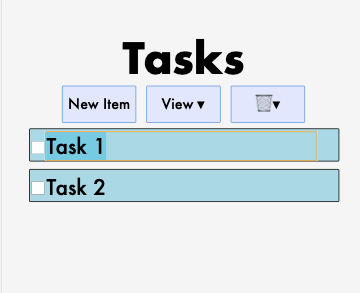
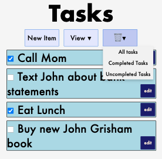
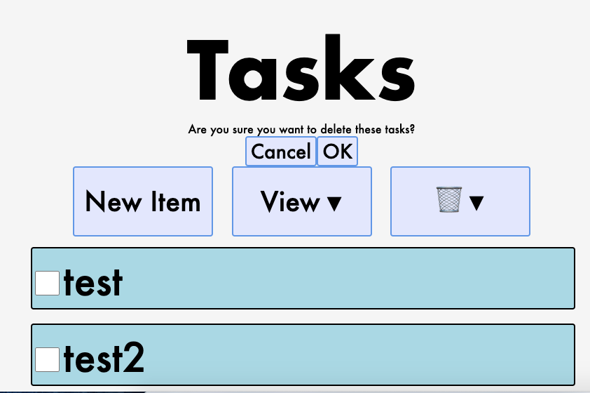
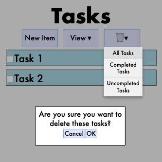
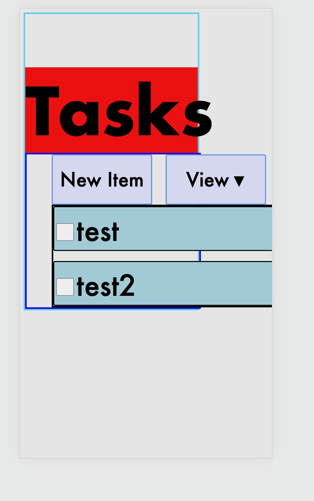

# Design Document
Kristen Mason & Hilary Nelson

#### Design Decisions & Alternative Designs Considered

Based on user feedback from Lab 1, we came into this lab knowing that we wanted to make a few changes to our initial HTML design when implementing it with React and JSX. We wanted to cut down on the number of clicks a user would need to make in order to enter a new item (or edit an existing one), so we decided to remove the intermediate step from Lab 1 where the user was prompted to enter the new task on a page separate from the task list. To simplify the action flow, users can now add new tasks and edit existing tasks directly from the home page by either clicking on the new task button or clicking on an existing task to edit its contents. 

Due to that design choice, we decided to remove the edit buttons that we had in the original task items design, as they were now redundant, and also took up valuable page space that could be used by our task items. An alternative design we considered involved leaving the edit buttons and preserving their functionality so that the user would click the edit button and have the respective task item’s contents be selected, but we realized that this only added to the total number of clicks and the flow could be simplified if we removed the edit button.

Another change we made from our original design based on good React practices that we learned in class was the addition of a delete confirmation alert. In our old design, when the user clicked on the option to delete options, the page automatically updated with the appropriate elements deleted. However, due to the nature of the drop down menus, we worried that there could be instances in which the user misclicked and deleted items when they meant to change the view or deleted items on accident. To remedy this, we introduced a popup alert that confirms that the user really wants to complete the delete action they selected, and provides them the opportunity to backtrack before making any irreversible changes to their task list. Originally, our alert appeared at the top of the page in rather small font

But after user testing we realized that this initial approach was not the best, as everyone we workshopped our design with did not notice the alert. After some reflection, we decided to update the design so that the alert greyed out the background (so that the user knows an alert is present somewhere on the screen), which made the whole alert process much more straightforward.

### User Testing

User 1)
This user was uncertain if they would be able to view previously deleted tasks. It seemed like the manual editing was a bit tedious (they tried to double click/ expected the cursor to appear at the end of the task instead of where they clicked). The “confirm deletion” alert was noticed the first time she attempted to delete items but it took a second to remember it the 2nd time, could be fixed by making the alert more of a popup/appear over the whole contents of the page as opposed to a small div at the top. The click to edit functionality was intuitive for the user

User 2)
User 2 experienced the same issue that user 1 had where they struggled with knowing where to click to best rename an item. It was straightforward that clicking on the task was how they were supposed to rename it, but they weren’t sure about how to edit the name from the end. She also faced some confusion with the dropdown menu when it didn’t retract when she clicked on it a second time. The alert was straightforward for the user. Alert text was very small and she had to squint to read it. 

Based on this feedback I think it would be good to iterate on our current design and make it so that a new task/top level task is automatically selected when the “New Task” button is clicked to make it more obvious that it is an editable field. This would also solve the cursor issue initially, because defaulting the items as selected would reduce the number of clicks the user would need to make in order to figure out the best place to type to rename the item. It could also be nice if in addition to focusing on the text box if all of the default text within the item was selected when the user clicked on a task so that the user didn’t need to go back and delete the entirety of the default text before adding their own.

Regarding the alert, I think that we could redesign it such that the alert was more in the user's face so they didn’t have to wonder why their delete action wasn’t working immediately. Making it an intrusive overlay over the task items would make it impossible to miss. Making the text of the alert bigger would also make it easier to understand the alert’s purpose. 

After speaking with our user testers, we returned to our project and made changes to our code so that the alert was more visible when delete options were selected, and we also edited the task items so that if a user clicked one to edit its contents that all of the initial text would be selected for increased ease of deletion.

#### Design Tasks and Walkthrough

The following diagrams represent the user's path and the design flow through each of the assigned tasks for this project. In these diagrams, "taps" are represented by ovals around the element that the tap action is being performed on, and the arrow graphics indicate a transition between states (e.g. between the start state and intermediate steps, between the intermediate steps and the final state, etc.) Images are to scale for the width of the Moto G4 screen but not to scale for height to save space while creating the composite image flows.

This is the flow for task 1: creating an item named "Buy new John Grisham book" in an empty list

This is the flow for task 2: creating an item named "Eat Lunch" in a non-empty list

This is the flow for task 3: Marking the item named "Call Mom" completed

This is the flow for task 4: Renaming the item "Text John" to "Text John about bank statements"

This is the flow for task 5: Show only uncompleted items

This is the flow for task 6: Delete all completed items.

#### Challenges Faced
The biggest challenge we faced was the formatting after we switched the display mode to Moto G4. Previously, the header had been centered and all the menu items were visible, but once we switched to Moto G4 everything was a little off. We had to make a lot of changes to our css during this phase (see the borders and backgrounds put in above) in order to finally figure out the problem. 

#### Parts of Design We're Most Proud Of
We are most proud of the new item/click to edit functionality and delete alert. Our original design adding/editing items was quite clunky and, although it was clear, it took more clicks than necessary. Our new design provides the same functionality, and shows the user how to edit a task right when they enter one (clicking to edit). We are also very happy with how the delete alert turned out. After some user feedback we decided that the alert was not clear enough, and greyed out the background and moved the alert to the center of the screen. The delete menu also stays open while this alert shows in order for the user to see what they’ve selected and ensure that it’s the correct choice.
