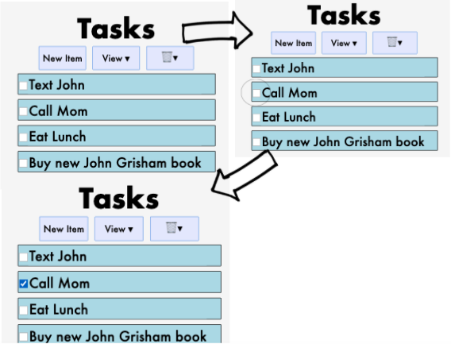

# Design Document
Kristen Mason & Hilary Nelson

#### Design Decisions & Alternative Designs Considered

Our current design is largely the same as the past two iterations of this project, aside from a couple additions. We added a priority level feature that allows users to select a priority for each task. We decided to implement this feature right on the task itself, so that users could easily edit any aspect of the tasks in as few clicks as possible. To make the priority more clear, we also set the background color of the tasks based on priority level– red being the highest priority, yellow being medium priority, and green being the lowest priority. 

 Before:

After:

Another feature we added in this round of iterations was sorting tasks. We added a “Sort By:” menu to our navigation panel, which takes inspiration from many online shopping sites. This feature allows users to rearrange and order their data based on what criteria the user deems important– they can sort by the date that tasks were added, display tasks in alphabetical order, and in ascending/descending priority (based off of the priority feature mentioned above.)

Inspiration for our sorting dropdown menu:

How we implemented our sorting dropdown:

We also added quality of life updates to the overall user experience in order to make the app more streamlined. We removed the default text from the task items and replaced it with placeholder text that vanishes automatically when the user types– we found that this was a much better approach than having the user delete the entire string “Click to Enter Task” each time they wanted to add a new task. We also updated the task item so that if an item is checked off, the text field becomes read only, so that the user wouldn’t accidentally change the name of a task once it was done. We also added visual cues to completed tasks, greying out the entire task item to indicate that it has been marked as “done.” Additionally, we modified our task item’s input area so that it would work for multi-line tasks. Previously, any text that didn’t fit into the input area was truncated by our app, but now longer tasks will have appropriately sized task items! 

Quality of Life Updates (Before & After):

Placeholder Text:

Behavior and Design when Checked:

Long Task Design:

We also upgraded our delete alert, displaying the number of tasks that are to be deleted within the confirmation.

Before:

After:

Lastly, we added a favicon of a green checkmark and title (Task List) to our React app to give it a bit of additional personality and flair.

#### Alternative Designs Considered

We discussed many possible alternative designs when it came to sorting before settling on our final design. Some ideas that were tossed around included sorting as you would in a spreadsheet style display (clicking the column header to sort by that column), or having our dropdown sort menu start unsorted. When dealing with some issues when it came to filtering data by our sorting dropdown in addition to filtering the data by its checked/unchecked status, we briefly considered removing the dropdown sorting menu when the view selected was anything other than “All Tasks”

Alternative Design Considered:

Actual Design Implemented:

Another alternative design choice we considered was making it possible to order tasks through Drag and Drop. We thought that this would be a cool way to give users additional freedom when it came to sorting their tasks, as it allowed for more possibilities than the ones that could fit into our sorting dropdown menu, and added a certain aspect of customization. However, the timeline of adding this feature to our app was not the best– we thought of it less than 24 hours before the lab was due, and although there was initial promise in making the Task Items draggable (see images below), we did not have enough time to work with the React-Beautiful-DnD library to work around the issues we ran into of tasks no longer being editable after they were dragged, and the tasks would not remain in-line when dragged, so ultimately we scrapped this design and went in another direction.

Drag & Drop Fails:

### User Testing

User 1)
Our first user successfully used all the features of the app when prompted, without any assistance. She liked the colors for the priority and said that everything was clear and easy to find. Her one recommendation was to allow task text to go onto multiple lines in case someone had a long task. We were able to implement this suggestion.

#### Design Tasks and Walkthrough

The following diagrams represent the user's path and the design flow through each of the assigned tasks for this project. In these diagrams, "taps" are represented by ovals around the element that the tap action is being performed on, and the arrow graphics indicate a transition between states (e.g. between the start state and intermediate steps, between the intermediate steps and the final state, etc.) Images are to scale for the width of the Moto G4 screen but not to scale for height to save space while creating the composite image flows.

This is the flow for task 1: creating an item named "Buy new John Grisham book" in an empty list

This is the flow for task 2: creating an item named "Eat Lunch" in a non-empty list

This is the flow for task 3: Marking the item named "Call Mom" completed

This is the flow for task 4: Renaming the item "Text John" to "Text John about bank statements"

This is the flow for task 5: Show only uncompleted items

This is the flow for task 6: Delete all completed items.

#### Challenges Faced
Our biggest challenge revolved around sorting. Firebase does not let you filter data by one field and sort it by another, and so we were very confused about how we were supposed to sort our data efficiently. We pretty much wrote off the idea of sorting the data after we retrieved it because that did not seem practical, but in the end that was our only option.

When adding multiline text editing, we ran into problems relating to the font size. Our font size was set quite large in the css, and it resulted in the text being larger than the text entry box. We couldn’t figure out the problem, because the text box size was not constrained elsewhere. We eventually figured out that the font size needed to be specified in TaskItem.js as well on the TextField element so that the box could be properly sized. 

#### Parts of Design We're Most Proud Of
The part of the design that we are most proud of is the priority color system. We think that it very effectively shows the tasks priorities, and it looks really nice when the tasks get sorted by priority. 

We’re also quite proud of the sorting dropdown and its functionality– we spent a lot of time struggling to find an efficient way to implement the sorting, which was frustrating, but figuring out the solution was very rewarding and it looks great in our webapp.
