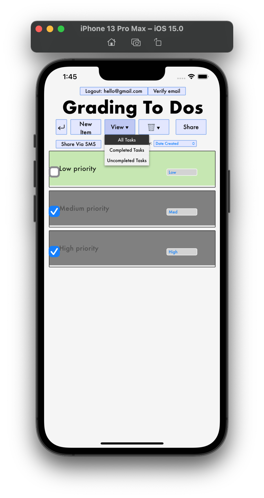

# Design Document
Kristen Mason & Hilary Nelson

#### Design Decisions & Alternative Designs Considered

Because our web app has from the start been designed with a mobile layout in mind, we found it very straightforward to preserve our previous design decisions from labs 1-5 while working on Lab 6. The Moto G4 layout was very similar to the simulated Apple device layouts in terms of dimensions, so we found ourselves really only having to make superficial changes to the CSS in order to make all of our task item elements appear on the screen as they had in our web app. Other than that, our React Native version of the app appears nearly identical to the version of the app we published for Lab 5– which was our goal.

Our deployed iOS app landing page design vs our Lab 5 deployed webapp landing page design:

### User Testing

The user who tested our iOS app had previously tested the web app, and so they were already familiar with the design. They said that the iOS app was very clear and intuitive, and did not have any feedback.

#### Comprehensive Design & Walkthrough

Below is a high level walkthrough of our React Native App:

Start at the initial landing page:

Then navigate to either the Log In or Sign Up buttons. 
Log In: 

Sign Up: 

If the user inputs a poorly formatted or invalid email, the recieve the error shown above.

Once logged into the app, the users home screen looks like it did in Lab 5:

Once at their home screen, the user can create and navigate to new task lists. 

Once the user is inside the task list, they can create new tasks:

Our sharing ability also persists from lab 5 to lab 6, and we have 2 ways through which they can share their task list– through email or SMS.

Once they confirm the phone number they want to share the task list with and hit send, a SMS message is sent to that number, similar to the one below:

Allold behavior from our Webapp is also functional in our React Native app–

Checking off tasks to mark them as completed:

Changing the priority of tasks (and having the color of the task change as a result)

Sorting tasks based off of Name, Date Created, Priority, etc:

Users can still modify the view of their task list, choosing to see All Tasks, Completed Tasks, or Uncomplete Tasks:

Finally, the user still has the ability to delete their tasks, and an alert is displayed when they click a delete option to ensure that the user intended to complete the action:

#### Challenges Faced

Having never worked with XCode prior to this attempt to port our app over to React Native, we found ourselves struggling while getting the app to run on XCode’s simulator. We also ran into several design issues with the CSS that came up during the port, with our task list items being awkwardly sized on the screen and also had to adjust the css in order to fit the tasks on the iPhone screen.

#### Parts of Design We're Most Proud Of

Again, as the design is nearly identical to our layout from Lab 5, we’re still very proud of the design choices that we have made in the process of designing this app. Specific to this challenge, we were actually very proud of ourselves for figuring out how to port a React app over to React Native– it was something that neither of us were familiar with, and React Native was a completely new language for us. Outside of the accomplishment of learning how to accomplish the assignment, we remain proud of our OAuth login capabilities with Google and Facebook (which honestly look even more at home as buttons on a Native app than they did on our web app) We are still quite proud of our feature that allows users to text their task lists to their phone via SMS, however we worry that by introducing this feature on the React Native app it may become redundant, as the purpose of enabling SMS sharing was so that users could access the task list off of the web app while on their phones, and the new React Native app allows users to access their task lists within the app interface much more easily than the web app did.
